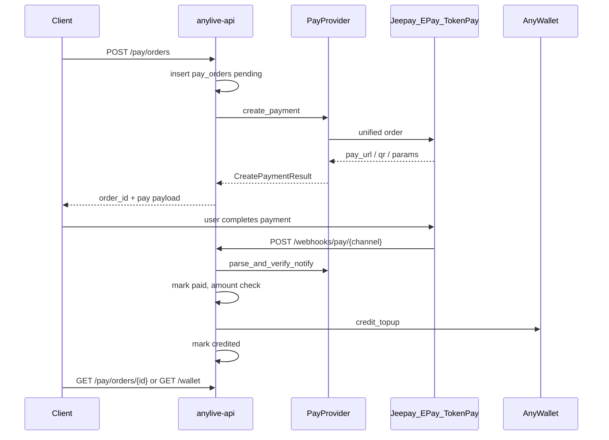

# 支付通道接入设计

> 状态：**控制面已落地** — `PayProvider` 端口 + 订单/币包 + Mock/Stripe/IAP/Jeepay/EPay/TokenPay **沙箱适配器** + webhook 入账 + 超时关单；真实 Stripe SDK / Store 收据 / 商户 API 待账号与密钥  
> 关联：[架构总览](./overview.md) · [技术评定与架构方案](../技术评定与架构方案.md) · [契约与接口冻结](../product/03-契约与接口冻结.md) · [海外合规与上架闸门](../compliance/海外合规与上架闸门.md) · [P1 现状](../product/p1-status.md)

**读者：** 后端 / 客户端 / SRE  
**范围：** 统一 `PayProvider` 端口，接入 **Jeepay、易支付（EPay 协议族）、TokenPay**，并与现有虚拟币钱包打通。

---

## 1. 目标与范围

### 1.1 目标

1. 用与 [`MediaProvider`](../../backend/crates/media/src/lib.rs) 同构的 **端口 + 多实现** 方式接入多种支付渠道。
2. 充值成功后 **仅** 通过现有钱包 `credit_topup` 入账（双分录、幂等），法币通道与钱包解耦。
3. 先支持三类流行/开源通道：
   - **Jeepay**：开源聚合支付（微信/支付宝/云闪付等路由）
   - **易支付（EPay 协议族）**：个人/商户常见 `submit.php` / `mapi.php` 协议
   - **TokenPay**：加密货币收款网关（部署/fork 细节可配置）
4. 契约可后续落入 `contracts/openapi` 与 `contracts/webhooks/pay.md`。

### 1.2 非目标（本文档明确不做）

| 非目标 | 说明 |
|--------|------|
| 实现代码 / migration / SDK 接入 | 本文仅设计；编码见 §9 分期 |
| 替代 App Store / Google Play IAP | 商店内购合规路径单独走 IAP Provider |
| Stripe 完整实现细则 | 海外默认路径见产品规划；可挂同一 `PayProvider`，字段级契约另文 |
| 客户端算税 / 改价 | 金额与币数一律服务端定价 |
| 虚拟币提现 / 法币出金 | 钱包为站内虚拟货币，不可兑换现金 |

### 1.3 与产品规划的关系

| 路径 | 定位 |
|------|------|
| 海外主路径（规划） | Stripe + App Store / Google Play IAP（见 [00-规划总览](../product/00-规划总览.md)） |
| 本文通道族 | **自托管 / CN 聚合 / 加密货币充值**；适合 H5、非商店分发、或 P6 Provider 替换 |
| 统一方式 | 全部实现 `PayProvider`；钱包只认内部 `order.paid` → `credit_topup` |

---

## 2. 现状（已实现 vs 缺口）

### 2.1 已实现（可复用）

| 能力 | 位置 | 说明 |
|------|------|------|
| Mock 充值 | [`backend/crates/api/src/routes/wallet.rs`](../../backend/crates/api/src/routes/wallet.rs) | `POST /api/v1/wallet/topups`；`ALLOW_MOCK_TOPUP=1`；单笔上限 `MAX_MOCK_TOPUP_AMOUNT = 100_000` |
| 生产禁止 mock | [`backend/crates/api/src/guards.rs`](../../backend/crates/api/src/guards.rs) | `APP_ENV=production` 时禁止 `ALLOW_MOCK_TOPUP` |
| 钱包领域 | [`backend/crates/wallet`](../../backend/crates/wallet) | `LedgerType::Topup`；`credit_topup(user, amount, reference)` |
| 双存储 | [`backend/crates/db/src/wallet.rs`](../../backend/crates/db/src/wallet.rs) | `AnyWallet::{Memory, Postgres}` |
| Topup 幂等 | `006_wallet_topup_idempotency.sql` | 部分唯一索引：`(user_id, reference) WHERE entry_type = 'topup'` |
| 礼物消费 | 同 wallet 路由 | 与支付无关；花的是已入账虚拟币 |
| Provider 模式样板 | [`MediaProvider`](../../backend/crates/media/src/lib.rs) | trait + SRS 实现；支付应对齐此风格 |
| 媒体 webhook 模式 | [`webhooks.rs`](../../backend/crates/api/src/routes/webhooks.rs) | 签名/密钥校验可参考（支付须更严格验签） |

**当前真实资金流（仅 dogfood）：**

```text
Client ──POST /api/v1/wallet/topups──► API (ALLOW_MOCK_TOPUP)
                                         │
                                         ▼
                                   AnyWallet.credit_topup
                                   wallet_ledger (topup) + balance++
```

无外部 PSP、无 `pay_orders`、无支付回调。

### 2.2 缺口清单（实现前必做）

1. **`PayProvider` trait** + 多实现注册（`jeepay` / `epay` / `tokenpay` / 后续 `stripe`）
2. **`pay_products` + `pay_orders` 表**与状态机（架构文档曾列 `pay_orders`，**库表未建**）
3. **充值 API**：渠道列表、币包目录、创建订单、查询订单（扩展或逐步替代 mock topup）
4. **`POST /api/v1/webhooks/pay/{channel}`**：验签 + 幂等入账
5. **币包（SKU）服务端定价**：法币金额 ↔ 金币
6. **环境变量与生产守卫**：启用渠道须完整密钥；生产继续禁止 mock
7. **客户端收银台**：选渠道 → 跳转/二维码/深链 → 轮询订单或拉余额
8. **（可选）** `pay_webhook_events` 落库、超时关单任务、对账脚本、NATS `order.paid`

### 2.3 目标架构

```text
Client
  │ GET /pay/channels, /pay/products
  │ POST /pay/orders
  ▼
anylive-api
  │ create_payment
  ▼
PayProvider ──► Jeepay | 易支付 | TokenPay | (Stripe...)
  │
  │ async notify
  ▼
POST /webhooks/pay/{channel}
  │ verify sign + amount
  │ pay_orders → paid
  │ credit_topup(reference=pay:{order_id})
  ▼
AnyWallet (ledger topup, idempotent)
```



---

## 3. 统一领域模型

### 3.1 概念

| 概念 | 标识 | 说明 |
|------|------|------|
| 支付渠道 | `PayChannel` | `jeepay` \| `epay` \| `tokenpay`（可扩展 `stripe` / `iap`） |
| 币包 / SKU | `PayProduct` | 服务端配置：`coins` + `amount` + `currency` + 上下架 |
| 充值订单 | `PayOrder` | 用户、SKU 快照、渠道、外部单号、状态、过期时间 |
| 支付参数 | `CreatePaymentResult` | 跳转 URL / 二维码内容 / JSAPI 参数等，按 `pay_mode` 区分 |
| 通知事件 | `NotifyEvent` | 验签后的标准化成功/失败/退款事件 |

### 3.2 订单状态机

```text
                  ┌──────────┐
                  │ pending  │  已建单，未向渠道下单或待用户支付
                  └────┬─────┘
                       │ create_payment 成功
                  ┌────▼─────┐
                  │  paying  │  已拿到支付参数，等待用户完成
                  └────┬─────┘
           success     │        timeout / cancel
         ┌─────────────┼─────────────┐
         ▼             │             ▼
   ┌──────────┐        │      ┌──────────┐
   │   paid   │        │      │ expired  │ 或 failed
   └────┬─────┘        │      └──────────┘
        │ credit_topup ok
   ┌────▼─────┐
   │ credited │  终态（成功）
   └──────────┘

旁路：paid/credited ──退款成功──► refunded
      （冲正策略见 §8；MVP 可只记状态 + 人工）
```

**规则：**

- 仅 `paid` → `credited` 调用 `credit_topup`；重复回调不得重复加币。
- 客户端展示可合并 `paid`/`credited` 为「成功」（余额以 `credited` 或 `GET /wallet` 为准）。
- 关单：`paying` 超过 `expires_at` → `expired`（后台任务或查询时惰性关单）。

### 3.3 幂等键

| 层级 | 键 | 用途 |
|------|-----|------|
| 建单（可选） | 客户端 `client_request_id` + `user_id` | 防连点重复建单 |
| 渠道通知 | `(channel, provider_event_id)` 或 `(channel, trade_no)` | 防重复处理 webhook |
| 入账 | `wallet_ledger.reference`，建议 `pay:{order_id}` | 与 `006` 部分唯一索引配合；同 order 多次 credit 安全 |

金额校验：**以 `pay_orders.amount` / `currency` 为准**；回调金额不一致 → 拒绝入账并告警。

### 3.4 表结构草案（后续 migration）

> 表名与字段为设计草案，实现时可微调命名；需新增 migration（当前最新为 `006_wallet_topup_idempotency.sql`）。

#### `pay_products`（币包）

```sql
CREATE TABLE pay_products (
    id              UUID PRIMARY KEY,
    sku             TEXT NOT NULL UNIQUE,          -- e.g. coins_100
    title           TEXT NOT NULL,
    coins           BIGINT NOT NULL CHECK (coins > 0),
    amount          NUMERIC(18, 2) NOT NULL CHECK (amount > 0),
    currency        TEXT NOT NULL DEFAULT 'CNY', -- ISO 4217; crypto 可用 USDT 等
    active          BOOLEAN NOT NULL DEFAULT TRUE,
    sort_order      INT NOT NULL DEFAULT 0,
    created_at      TIMESTAMPTZ NOT NULL DEFAULT now(),
    updated_at      TIMESTAMPTZ NOT NULL DEFAULT now()
);
```

#### `pay_orders`（充值订单）

```sql
CREATE TABLE pay_orders (
    id                  UUID PRIMARY KEY,
    user_id             UUID NOT NULL REFERENCES users(id),
    product_id          UUID REFERENCES pay_products(id),
    channel             TEXT NOT NULL,              -- jeepay | epay | tokenpay | ...
    status              TEXT NOT NULL,              -- pending|paying|paid|credited|failed|expired|refunded
    coins               BIGINT NOT NULL,            -- 快照
    amount              NUMERIC(18, 2) NOT NULL,    -- 快照
    currency            TEXT NOT NULL,
    client_request_id   TEXT,                       -- 可选幂等
    provider_trade_no   TEXT,                       -- 渠道侧单号
    provider_event_id   TEXT,                       -- 通知事件 id（若有）
    pay_mode            TEXT,                       -- redirect | qrcode | jsapi | ...
    pay_payload         JSONB,                      -- 返回给客户端的支付参数快照
    notify_raw_ref      TEXT,                       -- 可选：关联 webhook 存档
    expires_at          TIMESTAMPTZ,
    paid_at             TIMESTAMPTZ,
    credited_at         TIMESTAMPTZ,
    created_at          TIMESTAMPTZ NOT NULL DEFAULT now(),
    updated_at          TIMESTAMPTZ NOT NULL DEFAULT now()
);

CREATE UNIQUE INDEX pay_orders_user_client_request_uidx
    ON pay_orders (user_id, client_request_id)
    WHERE client_request_id IS NOT NULL;

CREATE UNIQUE INDEX pay_orders_channel_trade_no_uidx
    ON pay_orders (channel, provider_trade_no)
    WHERE provider_trade_no IS NOT NULL;

CREATE INDEX pay_orders_user_created_idx ON pay_orders (user_id, created_at DESC);
CREATE INDEX pay_orders_status_expires_idx ON pay_orders (status, expires_at);
```

#### `pay_webhook_events`（可选，推荐）

```sql
CREATE TABLE pay_webhook_events (
    id                  UUID PRIMARY KEY,
    channel             TEXT NOT NULL,
    provider_event_id   TEXT NOT NULL,
    order_id            UUID REFERENCES pay_orders(id),
    verified            BOOLEAN NOT NULL,
    process_status      TEXT NOT NULL,             -- received|processed|ignored|failed
    headers             JSONB,
    body                JSONB,
    error_message       TEXT,
    created_at          TIMESTAMPTZ NOT NULL DEFAULT now(),
    UNIQUE (channel, provider_event_id)
);
```

---

## 4. `PayProvider` 端口设计

对齐 `MediaProvider`：支付逻辑在独立 crate/module，API 层只做鉴权、建单、调端口、入账编排。

### 4.1 建议 trait（Rust 伪代码）

```rust
/// 渠道标识，与 DB / API 字符串一致
#[derive(Clone, Copy, Debug, PartialEq, Eq, Hash)]
pub enum PayChannel {
    Jeepay,
    Epay,
    TokenPay,
    // Stripe, IapAppStore, IapGoogle, ...
}

pub struct CreatePaymentRequest {
    pub order_id: Uuid,              // 内部单号 → 渠道 mchOrderNo / out_trade_no
    pub user_id: UserId,
    pub amount: Decimal,             // 服务端快照
    pub currency: String,
    pub coins: i64,
    pub subject: String,             // 商品描述
    pub notify_url: String,
    pub return_url: Option<String>,
    pub client_ip: Option<String>,
    pub extra: serde_json::Value,    // wayCode、链类型等渠道扩展
}

pub enum PayMode {
    Redirect { url: String },
    QrCode { content: String },
    Jsapi { params: serde_json::Value },
    None,                            // 仅等待链上/异步
}

pub struct CreatePaymentResult {
    pub pay_mode: PayMode,
    pub provider_trade_no: Option<String>,
    pub raw: serde_json::Value,      // 调试/落库，勿回传密钥
    pub expires_at: Option<Timestamp>,
}

pub enum PaymentStatus {
    Pending,
    Success {
        provider_trade_no: String,
        provider_event_id: Option<String>,
        paid_amount: Option<Decimal>,
    },
    Failed { reason: String },
    Closed,
}

pub struct NotifyEvent {
    pub order_id: Uuid,              // 或从 out_trade_no 解析
    pub status: PaymentStatus,
    pub provider_trade_no: String,
    pub provider_event_id: Option<String>,
    pub paid_amount: Option<Decimal>,
    pub paid_currency: Option<String>,
    pub raw: serde_json::Value,
}

#[async_trait]
pub trait PayProvider: Send + Sync {
    fn channel(&self) -> PayChannel;

    async fn create_payment(
        &self,
        req: CreatePaymentRequest,
    ) -> Result<CreatePaymentResult, AppError>;

    async fn query_payment(
        &self,
        order_id: Uuid,
    ) -> Result<PaymentStatus, AppError>;

    /// 验签 + 解析；失败返回错误（HTTP 层勿入账）
    async fn parse_and_verify_notify(
        &self,
        headers: &HeaderMap,
        body: &[u8],
    ) -> Result<NotifyEvent, AppError>;

    // 可选：退款
    // async fn refund(...) -> Result<..., AppError>;
}
```

### 4.2 注册与配置

```text
PayChannelRegistry
  ├─ enabled_channels: 从 env 解析，如 PAY_CHANNELS=jeepay,epay
  ├─ get(channel) -> Arc<dyn PayProvider>
  └─ 启动时：已启用渠道必须通过「密钥完整性」检查；production 下缺失配置则 fail-fast
```

**解耦原则：**

- `PayProvider` **不** 调用钱包。
- 入账编排在 API application service：`on_payment_success(order) -> credit_topup`。
- 与 `AnyWallet` 存储实现无关（Memory / Postgres 均可测）。

### 4.3 建议代码落位（实现阶段）

| 组件 | 建议路径 |
|------|----------|
| trait + 类型 | `backend/crates/pay`（新建）或 `backend/crates/wallet` 旁独立 crate |
| Jeepay / Epay / TokenPay | `backend/crates/pay/src/{jeepay,epay,tokenpay}.rs` |
| HTTP 路由 | `backend/crates/api/src/routes/pay.rs` + `webhooks` 下 pay 分支 |
| 编排 | API 层 service：create_order / handle_notify |

---

## 5. 端到端流程与异常

### 5.1 标准成功路径

1. 客户端 `GET /api/v1/pay/channels`、`GET /api/v1/pay/products`。
2. 用户选择币包 + 渠道 → `POST /api/v1/pay/orders`。
3. 服务端：校验产品上架 → 插入 `pay_orders`（`pending`，金额/币数快照）→ 调 `create_payment` → 更新 `paying` + `pay_payload` → 返回客户端。
4. 用户在渠道侧完成支付。
5. 渠道 `POST /api/v1/webhooks/pay/{channel}`：
   - `parse_and_verify_notify`
   - 写 `pay_webhook_events`（若启用）
   - 锁定订单；校验状态机与金额
   - `status = paid` → `credit_topup(user, coins, "pay:{order_id}")` → `credited`
   - 响应渠道要求的成功 ack（如 Jeepay/易支付约定字符串/`success`）
6. 客户端：`return_url` 落地页或轮询 `GET /api/v1/pay/orders/{id}`，并 `GET /api/v1/wallet` 刷新余额。

### 5.2 异常与策略

| 场景 | 策略 |
|------|------|
| 重复 webhook | 同一 `provider_event_id` / 已 `credited` → 直接 ack，不再 credit |
| 金额不一致 | 拒绝入账；订单标记异常/保持 paying；告警人工 |
| 渠道成功但 credit 失败 | 订单停在 `paid`；重试任务或 on-call 补入账（依赖 `pay:{order_id}` 幂等） |
| 用户取消 / 超时 | `expired` 或 `failed`；允许用户重新建单 |
| 仅 return_url 无 notify | **不可**仅凭浏览器回跳入账；可触发 `query_payment` 补偿 |
| 少付 / 超付（TokenPay） | 默认 **仅全额匹配** 入账；少付不入账；超付可入账按订单币数（多余不增币）或人工 |
| 退款 | 映射 `refunded`；冲正需独立 ledger 类型或 adjustment（合规文档要求策略文档化；MVP 可冻结余额 + 人工） |

### 5.3 与 mock topup 共存

| 环境 | Mock `POST /wallet/topups` | 真实 `/pay/*` |
|------|---------------------------|---------------|
| 本地 / dogfood | `ALLOW_MOCK_TOPUP=1` 可用 | 可选接沙箱渠道 |
| 生产 | **禁止**（已有 guards） | 仅启用已配置渠道 |

实现 M1 后建议：mock 作为 `PayChannel::Mock` 或保留独立路由但标注 deprecated。

---

## 6. 分渠道对接要点

### 6.1 对照总表

| 能力 | Jeepay | 易支付（EPay V1） | TokenPay |
|------|--------|-------------------|----------|
| 创建支付 | 统一下单 API | `mapi.php` 或 `submit.php` | 创建支付单 API（可配置 endpoint） |
| 查询 | 查单 API | 订单查询接口（实现略有差异） | 查单 / 链上状态 |
| 异步通知 | `notifyUrl` | `notify_url` | 可配置 notify |
| 签名 | 商户密钥签名（API Key） | V1: MD5；V2: RSA | Token / HMAC / 按部署 |
| 支付形态 | `wayCode` → JSAPI/扫码/跳转等 | 跳转收银台或返回二维码 URL | 地址/金额/过期；确认延迟更长 |
| 退款 | 视版本/通道 | 部分站点支持 | 视网关 |
| 沙箱 | 自建/演示环境 | 测试商户 | 测试网/小额 |

### 6.2 Jeepay

**角色：** AnyLive 作为商户系统，调用自建或托管的 Jeepay 支付网关；Jeepay 再路由微信/支付宝等。

**对接要点：**

- 统一下单：请求含 `mchNo`、`appId`、`mchOrderNo`（= 内部 `order_id`）、金额、`notifyUrl`、`wayCode` 等。
- 签名：按 Jeepay 文档对参数排序签名（API Key）；回调同样验签。
- 响应：按支付方式返回 payData（二维码、跳转链接、JSAPI 参数等）→ 映射为 `PayMode`。
- 回调：支付成功态 + 金额校验 → 入账；响应 Jeepay 要求的成功报文。

**配置项草案：**

| 变量 | 说明 |
|------|------|
| `JEEPAY_BASE_URL` | 网关根 URL |
| `JEEPAY_MCH_NO` | 商户号 |
| `JEEPAY_APP_ID` | 应用 ID |
| `JEEPAY_API_KEY` | 签名密钥 |
| `JEEPAY_NOTIFY_URL` | 公网可达，如 `https://api.example.com/api/v1/webhooks/pay/jeepay` |
| `JEEPAY_DEFAULT_WAY_CODE` | 可选默认支付方式 |

参考：[Jeepay 支付接口文档](https://docs.jeequan.com/docs/jeepay/payment_api)

### 6.3 易支付（EPay 协议族）

**说明：** 业界存在多套「易支付」兼容实现，字段大体一致但 URL 与 V2 细节不同。AnyLive **不绑死单一托管商**，而以 **可配置 `EPAY_API_URL` + 协议版本** 适配。

**V1（优先落地）：**

- `submit.php`：表单/跳转收银台（适合 H5）。
- `mapi.php`：服务端下单，返回二维码或支付链接（推荐 App/H5 统一走服务端）。
- 签名：参数按规则拼接 + `key` 做 MD5；`sign_type=MD5`。
- 常见字段：`pid`、`type`、`out_trade_no`、`notify_url`、`return_url`、`name`、`money`、`sign`。

**V2（后续）：** RSA 签名、独立 API 路径、退款/代付等；作为 `EPAY_PROTOCOL=v2` 扩展。

**映射：**

| 易支付 | AnyLive |
|--------|---------|
| `out_trade_no` | `pay_orders.id` |
| `money` | `pay_orders.amount`（服务端） |
| `notify_url` | `/api/v1/webhooks/pay/epay` |
| `return_url` | H5 结果页（不入账） |
| 异步 `trade_no` | `provider_trade_no` |

**配置项草案：**

| 变量 | 说明 |
|------|------|
| `EPAY_API_URL` | 站点根或 API 根 |
| `EPAY_PID` | 商户 ID |
| `EPAY_KEY` | MD5 密钥（V1） |
| `EPAY_PROTOCOL` | `v1`（默认）/ `v2` |
| `EPAY_NOTIFY_URL` | 异步通知 |
| `EPAY_RETURN_URL` | 浏览器回跳 |
| `EPAY_RSA_PRIVATE_KEY` / `EPAY_PLATFORM_PUBLIC_KEY` | V2 时使用 |

### 6.4 TokenPay

**定位：** 加密货币收款。具体 HTTP 字段因开源项目/自建 fork 而异，适配层原则：

1. 创建支付单：内部 `order_id`、应付金额/币种、过期时间、notify URL。
2. 返回：收款地址、应付 crypto 金额、二维码、过期时间 → `PayMode::QrCode` 或 `None` + 展示字段。
3. 异步通知 / 主动查询：确认数达到阈值后视为成功。
4. **全额匹配**（默认）：实付 ≥ 订单应付且币种一致才入账；少付不入账；超付不增加金币。

**与法币通道差异：**

| 点 | 处理 |
|----|------|
| 确认延迟 | `expires_at` 更长；客户端轮询间隔加大；可显示「确认中」 |
| 汇率 | 下单时快照法币或稳定币标价；**不在客户端换算** |
| 精度 | Decimal 存储；与渠道精度对齐规则写在适配器 |

**配置项草案：**

| 变量 | 说明 |
|------|------|
| `TOKENPAY_BASE_URL` | API 根 |
| `TOKENPAY_API_TOKEN` 或密钥对 | 鉴权 |
| `TOKENPAY_NOTIFY_URL` | 异步通知 |
| `TOKENPAY_SUPPORTED_ASSETS` | 如 `USDT-TRC20,USDT-ERC20` |
| `TOKENPAY_MIN_CONFIRMATIONS` | 可选，覆盖渠道默认 |

---

## 7. HTTP 契约草案

> 前缀：`/api/v1`。冻结后写入 OpenAPI（规划波次 v0.7 `pay`）。  
> 鉴权：除 webhooks 外均需用户 Bearer；webhooks 用渠道签名，不走用户 JWT。

### 7.1 业务 API

| 方法 | 路径 | 说明 |
|------|------|------|
| GET | `/api/v1/pay/channels` | 当前环境 **已启用** 的渠道列表 |
| GET | `/api/v1/pay/products` | 上架币包目录 |
| POST | `/api/v1/pay/orders` | 创建充值订单并拉起渠道支付 |
| GET | `/api/v1/pay/orders/{id}` | 查询订单（仅本人） |

#### `GET /pay/channels` 响应示例

```json
{
  "items": [
    { "id": "jeepay", "title": "Jeepay", "pay_modes": ["qrcode", "redirect"] },
    { "id": "epay", "title": "EPay", "pay_modes": ["redirect", "qrcode"] },
    { "id": "tokenpay", "title": "TokenPay", "pay_modes": ["qrcode"] }
  ]
}
```

#### `GET /pay/products` 响应示例

```json
{
  "items": [
    {
      "id": "uuid",
      "sku": "coins_100",
      "title": "100 Coins",
      "coins": 100,
      "amount": "6.00",
      "currency": "CNY"
    }
  ]
}
```

#### `POST /pay/orders` 请求 / 响应示例

```json
// request
{
  "product_id": "uuid",
  "channel": "epay",
  "client_request_id": "optional-idempotency-key",
  "return_url": "https://h5.example.com/pay/result",
  "extra": { "type": "alipay" }
}

// response
{
  "id": "order-uuid",
  "status": "paying",
  "coins": 100,
  "amount": "6.00",
  "currency": "CNY",
  "channel": "epay",
  "pay_mode": "redirect",
  "pay_url": "https://pay.example.com/submit?...",
  "qr_content": null,
  "jsapi_params": null,
  "expires_at": "2026-07-22T12:00:00Z"
}
```

#### `GET /pay/orders/{id}` 响应示例

```json
{
  "id": "order-uuid",
  "status": "credited",
  "coins": 100,
  "amount": "6.00",
  "currency": "CNY",
  "channel": "epay",
  "paid_at": "2026-07-22T11:55:00Z",
  "credited_at": "2026-07-22T11:55:01Z"
}
```

### 7.2 Webhook

| 方法 | 路径 | 说明 |
|------|------|------|
| POST | `/api/v1/webhooks/pay/jeepay` | Jeepay 异步通知 |
| POST | `/api/v1/webhooks/pay/epay` | 易支付异步通知 |
| POST | `/api/v1/webhooks/pay/tokenpay` | TokenPay 异步通知 |

**公共规则：**

1. 原始 body 用于验签，避免先 JSON 再序列化导致签名失败。
2. 验签失败 → 4xx，不入账。
3. 处理成功 → 按渠道文档返回 ack（纯文本 `success` / JSON 等）。
4. 不在此接口做用户鉴权；不暴露内部错误细节。

### 7.3 Mock 与遗留

| 方法 | 路径 | 说明 |
|------|------|------|
| POST | `/api/v1/wallet/topups` | **仅** `ALLOW_MOCK_TOPUP=1`；生产禁止 |
| GET | `/api/v1/wallet` · `/wallet/ledger` | 入账后余额与流水查询（已实现） |

规划中的 `GET /wallet/topups/{id}` 可由 `GET /pay/orders/{id}` 替代或并存。

### 7.4 错误码（建议追加至 `contracts/errors/codes.yaml`）

| code | HTTP | 含义 |
|------|------|------|
| `PAY_CHANNEL_DISABLED` | 400 | 渠道未启用 |
| `PAY_PRODUCT_INACTIVE` | 400 | 币包下架 |
| `PAY_ORDER_NOT_FOUND` | 404 | 订单不存在 |
| `PAY_ORDER_EXPIRED` | 409 | 订单已过期 |
| `PAY_PROVIDER_ERROR` | 502 | 渠道调用失败 |
| `PAY_NOTIFY_INVALID` | 400 | 回调验签失败 |
| `PAY_AMOUNT_MISMATCH` | 409 | 回调金额与订单不符 |

### 7.5 事件（可选，与契约文档对齐）

| Subject | 触发 | 消费者 |
|---------|------|--------|
| `order.paid` | 订单进入 `paid`（入账前或后需固定一种） | wallet 入账 worker（若异步） |
| `order.refunded` | 退款确认 | 冲正 / 冻结 |

MVP 可同步入账，事件后补；若同步入账，则 `order.paid` 仅用于统计。

---

## 8. 安全与合规

1. **回调必须验签**；禁止只信 query/`out_trade_no`。
2. **价格以服务端 `pay_orders` 快照为准**；忽略客户端传入金额改价。
3. **密钥** 仅环境变量或 secret manager；日志禁止打印完整 key、完整回调敏感字段。
4. **Webhook URL** 必须 HTTPS 公网；开发可用隧道，勿在生产关验签。
5. **虚拟货币**：不可兑换现金的产品文案；收据可查订单 + `wallet_ledger`。
6. **IAP vs Web**（见 [海外合规](../compliance/海外合规与上架闸门.md)）：
   - 本文通道默认服务 **H5 / Web / 非商店分发**。
   - App 若上架商店并销售虚拟币，须单独评估 IAP 义务；实现仍走 `PayProvider`，但渠道为 IAP，而非 Jeepay/易支付绕过商店。
7. **生产守卫**：`APP_ENV=production` → mock 关闭；`PAY_CHANNELS` 中每个渠道配置完整性检查 fail-fast。
8. **权限**：用户只能查自己的订单；管理端补单/退款走 admin + audit（后续）。

---

## 9. 实现分期（Roadmap）

| 阶段 | 内容 | 退出标准 |
|------|------|----------|
| **M0** | 本文档；OpenAPI/事件草案骨架 | 评审通过 |
| **M1** | migration：`pay_products`/`pay_orders`；`PayProvider` trait；`MockPayProvider`；创建/查询 API | 集成测试：mock 渠道全链路 credited |
| **M2** | **二选一** 打通 Jeepay **或** 易支付 V1 sandbox | 真实回调入账；重复通知幂等 |
| **M3** | 第二渠道 + 统一 webhook 中间层 + `pay_webhook_events` | 双渠道 dogfood |
| **M4** | TokenPay；超时关单任务；对账脚本（渠道成功 vs ledger） | 加密货币路径可测 |
| **M5** | Flutter / H5 收银台 UI；生产关闭 mock 依赖 | 用户可完成选包→支付→余额可见 |

**建议 M2 优先级：** 若以 H5/国内聚合为主，易支付 V1 往往接入更快；若已有 Jeepay 运维，则优先 Jeepay。

---

## 10. 环境变量汇总

| 变量 | 阶段 | 说明 |
|------|------|------|
| `ALLOW_MOCK_TOPUP` | 已有 | 仅非生产 dogfood |
| `PAY_CHANNELS` | M1+ | 逗号分隔：`jeepay,epay,tokenpay` |
| `JEEPAY_*` | M2/M3 | 见 §6.2 |
| `EPAY_*` | M2/M3 | 见 §6.3 |
| `TOKENPAY_*` | M4 | 见 §6.4 |
| `PAY_ORDER_TTL_SECS` | M1+ | 默认订单过期（如 1800） |
| `PUBLIC_API_BASE_URL` | M1+ | 拼接默认 notify URL |

---

## 11. 验收标准

### 11.1 文档级（本文读者）

- [ ] 能说明：**为何现在不能直接接外部支付**（无订单表/Provider/webhook）。
- [ ] 能指出 **唯一入账点**：`credit_topup` + `reference = pay:{order_id}`。
- [ ] 能区分 Jeepay / 易支付 / TokenPay 的创建、通知、签名差异。
- [ ] 实现者可按 §3–§4 直接开 migration 与 trait，无需再猜边界。

### 11.2 实现级（后续编码）

- [ ] 重复 webhook 不导致重复加币。
- [ ] 金额篡改/不一致不入账。
- [ ] 生产无法开启 mock topup；未配置渠道无法出现在 `/pay/channels`。
- [ ] 支付确认到余额可见满足 [非功能](../product/04-非功能与容量.md) 目标（理想 ≤5s，Webhook 重试下 ≤30s）。

---

## 12. 参考路径速查

| 路径 | 用途 |
|------|------|
| [`backend/crates/api/src/routes/wallet.rs`](../../backend/crates/api/src/routes/wallet.rs) | Mock topup / 钱包 HTTP |
| [`backend/crates/api/src/guards.rs`](../../backend/crates/api/src/guards.rs) | 生产 feature flags |
| [`backend/crates/wallet`](../../backend/crates/wallet) | 账本领域 |
| [`backend/crates/db/src/wallet.rs`](../../backend/crates/db/src/wallet.rs) | Postgres/Memory 钱包 |
| [`backend/crates/media/src/lib.rs`](../../backend/crates/media/src/lib.rs) | Provider 模式样板 |
| [`backend/crates/api/src/routes/webhooks.rs`](../../backend/crates/api/src/routes/webhooks.rs) | Webhook 路由样板 |
| [`docs/product/p1-status.md`](../product/p1-status.md) | 权威现状：无真实支付 |
| [`docs/product/03-契约与接口冻结.md`](../product/03-契约与接口冻结.md) | OpenAPI / pay webhook 冻结 |

---

## 修订记录

| 日期 | 说明 |
|------|------|
| 2026-07-22 | 初版：现状、PayProvider、三渠道、契约、安全、分期 |
